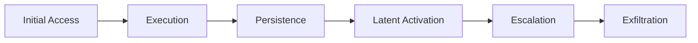
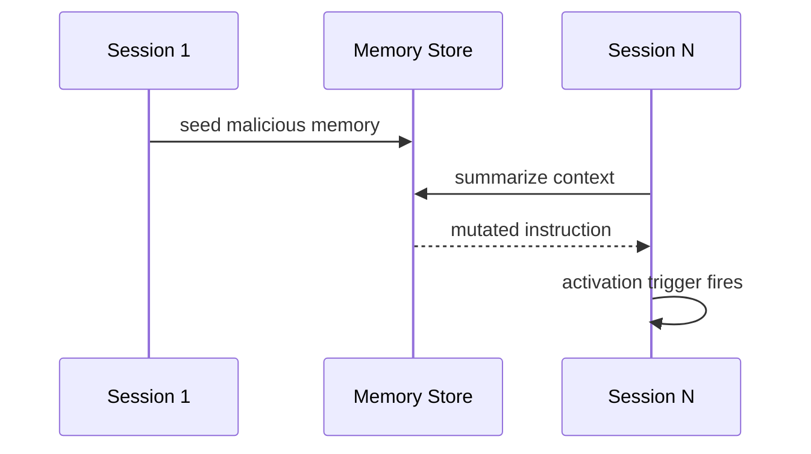

# Attack Taxonomy

## Core categories
- html_injection
- rag_poisoning
- markdown_injection
- memory_poisoning
- latent_memory_poisoning
- context_drift
- toolchain_confusion
- cognitive_overload

## Diagram: lifecycle

## Diagram: latent timeline

